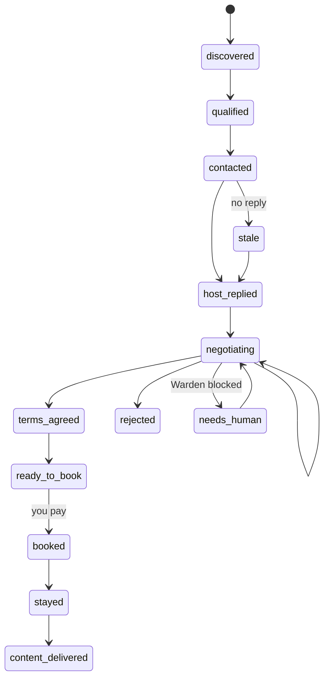

# 🏠 Airbnb Automate

An agent office that finds places to stay across India, writes a personal message to each host, negotiates a content-for-stay collaboration, and hands you the deals that are ready to book.

You supply the card. Everything up to that point runs on its own.

---

## How it works

A standing **deal office** runs on its own. A **Proposer** keeps inventing places to stay — all over India and abroad — the moment the shortlist runs low; a **Planner** turns those into jobs on a durable queue. A fixed roster of specialists drains it. There is no form to fill in and no dates to pick: you configure *who you are* and the guardrails, and the office does the rest.

The queue is split across two lanes so the one browser is never a bottleneck:

- **Office** — proposes, researches, scores and *drafts* outreach. No browser, no Airbnb session, so it can run anywhere.
- **Courier** — owns the single Airbnb browser session and does everything that touches it: discover, enrich, send, sync the inbox, negotiate.

Roles never change — the *work* is what multiplies.

| Agent | Does | Lives in |
|---|---|---|
| **Proposer** | Invents new destinations when the live shortlist runs low, skipping places already tried or visited | [app/agent/proposer.py](app/agent/proposer.py) |
| **Planner** | Breaks the work into jobs, keeps the pipeline fed, drafts before it sends | [app/agent/planner.py](app/agent/planner.py) |
| **Scout** | Researches a place month by month — seasonality, connectivity, cost, events | [app/agent/scout.py](app/agent/scout.py) |
| **Router** | Orders places into a route that makes geographic sense | [app/agent/router.py](app/agent/router.py) |
| **Prospector** | Scrapes listings, then the detail page for real context | [app/listing_detail.py](app/listing_detail.py) |
| **Analyst** | Scores which hosts are actually likely to say yes | [app/agent/analyst.py](app/agent/analyst.py) |
| **Scribe** | Writes the opening message from the host's own words | [app/agent/scribe.py](app/agent/scribe.py) |
| **Closer** | Negotiates across rounds, sends replies, extracts agreed terms | [app/agent/closer.py](app/agent/closer.py) |
| **Warden** | Blocks any message that breaks your rules — deterministic, not a prompt | [app/warden.py](app/warden.py) |
| **Chronicler** | Builds the brief and the dashboard | [app/agent/chronicler.py](app/agent/chronicler.py) |

The agents run **fully autonomously up to Airbnb's payment wall**. They propose, research, draft, negotiate, agree terms, and stop — because only you can pay. When a step fails the office replans and keeps hunting; a blocked draft is rewritten at most twice, then dropped, without bothering you.

### The pipeline

Drafting is separated from sending: the **Office** writes and the **Courier** delivers, so a dead Airbnb session never stops the office from researching and drafting ahead.

```
standing office
  → propose places           (Proposer · Office)
  → research each place       (Scout · Office)
  → discover listings         (Courier)
  → enrich from detail page   (Courier)
  → score the lead            (Analyst · Office)
  → draft outreach            (Scribe → Warden · Office)   ← saved, not sent
  → deliver outreach          (Courier → send budget)
  → host replies              (inbox sync · Courier)
  → negotiate                 (Closer → Warden → send budget · Courier)
  → extract agreed terms      (Closer)
  → READY TO BOOK             ← you take over here
```

### Every host relationship is a Deal



Every transition is an append-only event, so the dashboard funnel is derived from history rather than guessed at.

---

## 🚀 Quick Start

### 1. Install

```bash
python3 -m venv .venv
source .venv/bin/activate
pip install -r requirements.txt
playwright install chromium
# Recommended — real Chrome makes Airbnb's OAuth login work reliably
playwright install chrome
```

Set `PLAYWRIGHT_CHANNEL=chrome` in `.env` when using the Chrome channel.

### 2. Configure

```bash
cp .env.example .env
```

At minimum set an LLM key (`GOOGLE_API_KEY` for the default Gemini provider). Then review the **guardrail** block — with full autonomy those values are the only thing between the model and a commitment you have to honour.

### 3. Log in to Airbnb, once

Airbnb blocks automated sign-in, so you do it by hand and the session persists in
a Chrome profile at `data/airbnb_browser_profile/` (with a cookie backup at
`data/browser_state.json`). The worker reuses it for every scrape and send.

```bash
make login
```

If the login never "sticks" or the browser opens logged out:

1. Set `PLAYWRIGHT_CHANNEL=chrome` and run `playwright install chrome`, **or**
2. Start Chrome yourself with `--remote-debugging-port` and a dedicated
   `--user-data-dir`, log in to Airbnb there, leave it open, and set
   `CHROME_CDP_URL` in `.env` so the app attaches to *your* browser instead of
   launching one.

### 4. Run it

```bash
make up
```

That builds the Docker image and runs the office, the courier, and the
dashboard at <http://127.0.0.1:8000>. **There is nothing to set up on the
page** — the office starts proposing places and working them on its own.

The image installs Chromium only. The first `make up` still downloads that
browser; later runs reuse it.

```bash
make down
```

Stops the containers.

### 5. Watch it on your phone

The dashboard is the stats: the status strip, closes per 100 messages, the
pipeline, the job queue, prompt performance and agent cost. Drafts and delivery
are on **Messages**. Deals that need you are on **Needs a human** and **Ready
to book**. What each lane is doing is on **Loops**, and the log tail is on
**Logs**. Every page refreshes every 10 seconds. You never create a campaign;
the office invents its own work.

### 6. Leave it running

`make up` is the office, the courier, and the API as separate containers
sharing `./data` (the database and the Airbnb profile from `make login`).
They keep running until `make down`. Point your phone at this machine's
address on your network, port 8000, and set the Telegram variables (below) so
it can ping you for the moments that need a human.

---

## Daily use

Open the dashboard. The buttons cover the common actions — freeze/resume
sending, sync the inbox, plan work now.

If you prefer the terminal:

```bash
make brief      # what happened, what needs you
make status     # queue depth + sends left in the window
make freeze     # panic button — takes effect mid-run
make resume

python manage.py itinerary   # the route the Router planned
```

`make brief` output:

```
  Closes / 100 messages : 12.5
  Reply rate            : 31.2%
  Messages sent         : 32
  Sends left in window  : 3/5

  READY TO BOOK (2) — needs your card
    · Asha — Sea Breeze Villa (2026-11 → 2026-12)
    · Ravi — Hill Hut (window TBC)

  NEEDS A HUMAN (1)
    · Meera — [price_ceiling] agrees to 8000 per night but only free stays…

  ALERTS
    ! The Warden blocked 1 draft(s) in the last 24h.
```

---

## 🛡 Guardrails

The agents send without asking you. So the rules live in **code**, not in the prompt — a system prompt saying "never promise specific dates" is a suggestion a model can talk itself out of. The Warden reviews the **final text** after generation and either allows it or blocks it.

A blocked draft parks its deal in `needs_human` and shows up on the dashboard. It fires if the message would:

| Rule | Example that gets blocked |
|---|---|
| Exceed your per-night ceiling | "I'd be happy to pay ₹8000 per night" |
| Commit to specific dates | "Let's lock in Dec 12 to Dec 19" |
| Over-promise deliverables | "I'll make 10 reels for you" |
| Leak contact details | "Call me on 9876543210" |
| Move off-platform | "Let's do a direct booking over WhatsApp" |
| Inflate your reach | "I have 500k followers" |
| Exceed the per-thread reply cap | a 5th agent reply on one conversation |

Quoting a host's price back to them is **not** a violation — the price rule only fires in a committing context ("pay", "agree", "happy to"). The Warden never rewrites a draft; it allows or refuses.

Set the values in `.env` (seeds the policy on first run) or change them live:

```bash
curl -X POST localhost:8000/api/policy \
  -H 'content-type: application/json' \
  -d '{"max_price_per_night": 2500, "max_agent_replies_per_thread": 3}'
```

### Kill switch

One flag freezes every outbound message. The worker re-reads it immediately before each send, and again *after* the rate-limit wait — which can last hours — so a freeze takes effect mid-run.

```bash
make freeze     # or: python manage.py freeze --reason "account looks flagged"
make resume
```

---

## 🐢 Send budget

Airbnb blocks bulk messaging. v1 only counted first-touch outreach, so auto-sending negotiation replies would have silently doubled the real rate against an unchanged cap.

In v2 **outreach and negotiation share one sliding window**. Negotiation isn't exempt — it just gets higher queue priority, because a warm thread is worth far more than a cold message. Defaults: **5 sends per 3 hours**, with ~120s spacing and jitter between attempts.

Two consequences worth knowing:

- The **Planner applies backpressure** — it won't queue sends it has no budget to deliver. Queueing a hundred against a five-send window just hides the constraint.
- Because volume is capped, the dashboard leads with **deals closed per 100 messages**. The only way to improve is to convert better: research harder, score more selectively, write a better message.

If Airbnb shows its in-app limit banner, outreach stops, marks the rest skipped, and moves on.

Tune with `OUTREACH_MAX_SENDS_PER_WINDOW`, `OUTREACH_RATE_WINDOW_SECONDS`, and `OUTREACH_INTER_MESSAGE_DELAY_SECONDS`.

---

## 🏗 Project Structure

```
airbnb-automate/
├── manage.py               # Entry point — `start`; `worker --role office|courier`; login / brief
├── Makefile                # make login / up / down / test
├── Dockerfile              # One image; the compose file runs it as office / courier / api
├── docker-compose.yml      # Always-on: office + courier + api on one data volume
├── locations.md            # Optional seed for the manual `campaign` CLI (office ignores it)
│
├── app/
│   ├── worker.py           # Leases jobs by role, dispatches them; the Courier owns the browser
│   ├── jobs.py             # Durable queue: enqueue / lease / retry / idempotency
│   ├── activity.py         # Office & Courier loop feeds, read from the durable job record
│   ├── notify.py           # Telegram pings for the three human moments
│   ├── warden.py           # Deterministic guardrail validator
│   ├── policy.py           # Guardrail config + kill switch (DB-backed, live)
│   ├── send_budget.py      # One shared send window for every channel
│   ├── logging_config.py   # Readable console output + the UI activity feed
│   │
│   ├── deals.py            # Deal repo + state machine + message log
│   ├── leads.py            # Lead repo: enrichment + collab-fit score
│   ├── territories.py      # Places, research profiles, saturation counters
│   ├── campaigns.py        # Campaign goals and planned itineraries
│   │
│   ├── inbox.py            # Inbox sync + in-thread replies
│   ├── thread_linking.py   # Links a sent message to the thread it became
│   ├── listing_detail.py   # Detail-page scrape (the "public context")
│   ├── scraper.py          # Search-results scrape
│   ├── outreach.py         # Airbnb login + listing-page messaging (Playwright)
│   ├── browser_session.py  # Persistent Chrome profile / CDP attach
│   ├── database.py         # SQLite layer
│   ├── models.py           # Deal, Lead, Job, Territory, Campaign, …
│   ├── config.py           # Env configuration
│   │
│   ├── migrations/         # Numbered SQL, applied in order and recorded
│   │   └── sql/            # 0001 baseline · 0002 agent office · 0003 backfill · 0004 drop legacy
│   │
│   ├── agent/
│   │   ├── proposer.py     # Invents new destinations when the shortlist runs low
│   │   ├── planner.py      # Decomposes goals into jobs, drafts before it sends
│   │   ├── scout.py        # Destination research
│   │   ├── router.py       # Route + month assignment
│   │   ├── analyst.py      # Lead scoring
│   │   ├── scribe.py       # Opening messages
│   │   ├── closer.py       # Negotiation + terms extraction
│   │   ├── chronicler.py   # Brief, funnel, north-star metric
│   │   ├── prompts_v2.py   # Prompts built from the policy fact sheet
│   │   ├── runs.py         # Token / cost / latency ledger
│   │   ├── llm.py          # Provider abstraction (Gemini / OpenAI / Perplexity)
│   │   └── chat_reader.py  # Inbox scraping
│   │
│   └── api/
│       ├── main.py         # FastAPI routes
│       └── dashboard.py    # Server-rendered dashboard
│
├── data/                   # Runtime data (gitignored) — DB, Chrome profile, logs
└── tests/                  # Includes a Warden red-team corpus and an e2e walk
```

---

## 📍 `locations.md`

One destination per line in the project root; lines starting with `#` are comments.
The standing office no longer needs this file — the **Proposer** invents places on
its own. It remains an optional seed for the manual `manage.py campaign` command,
which reads it when you don't pass `--places` / `--places-file`.

These are only *candidates* — the Scout researches each one and the Router decides which actually make the itinerary, and in which month.

---

## 🔗 Flexible search URLs

Flexible searches use Airbnb's **structured** explore params: `refinement_paths[]`, `flexible_trip_dates[]` (lowercase English months), `monthly_start_date` / `monthly_length` / `monthly_end_date`, `flexible_trip_lengths[]` (`one_week`, `one_month`, `weekend_trip`), and `price_filter_num_nights`. Path slugs follow **“City, Region” → `City--Region`**. Tune with **`AIRBNB_BASE_URL`** (e.g. `https://www.airbnb.co.in`) and **`FLEX_TRIP_MONTHS_COUNT`**.

---

## ⚙️ Configuration

### Guardrails

These seed the `policy` table on first run. After that the dashboard is the source of truth, and changes apply **without restarting the worker**.

| Variable | Description | Default |
|---|---|---|
| `MAX_PRICE_PER_NIGHT` | Most an agent may agree to pay. `0` = free stays only; any paid counter-offer is escalated to you | `0` |
| `PRICE_CEILING_CURRENCY` | Currency the ceiling is in | `INR` |
| `ALLOWED_DELIVERABLES` | Comma-separated. The number in each entry is the cap, so "2 Instagram reels" blocks a draft offering three | 2 reels, 10 photos, 1 review, stories |
| `MAX_AGENT_REPLIES_PER_THREAD` | Replies one thread may get before it is parked for you | `4` |
| `CREATOR_NAME` / `CREATOR_ROLE` | Who the agent says you are | Sachin / founder, The Boring Education |
| `CREATOR_FOLLOWERS` | The largest reach claim permitted | `150k+ combined` |
| `CREATOR_HANDLES` | The only handles an agent may name | `@theboringfounder, @theboringeducation` |

### Rate limiting

| Variable | Description | Default |
|---|---|---|
| `OUTREACH_MAX_SENDS_PER_WINDOW` | Shared cap across outreach **and** negotiation | `5` |
| `OUTREACH_RATE_WINDOW_SECONDS` | Sliding window length | `10800` (3h) |
| `OUTREACH_INTER_MESSAGE_DELAY_SECONDS` | Minimum pause between attempts | `120` |

### Browser & search

| Variable | Description | Default |
|---|---|---|
| `DATABASE_PATH` | SQLite path | `data/airbnb_automate.db` |
| `AIRBNB_BASE_URL` | Origin for search URLs | `https://www.airbnb.com` |
| `FLEX_TRIP_MONTHS_COUNT` | Consecutive months in `flexible_trip_dates[]` | `3` |
| `HEADLESS` | Run the browser headless | `true` |
| `PLAYWRIGHT_CHANNEL` | Use installed `chrome` / `msedge` — fixes OAuth login | bundled Chromium |
| `BROWSER_USER_DATA_DIR` | Persistent profile path; `none` to disable | `data/airbnb_browser_profile` |
| `CHROME_CDP_URL` | Attach to your own running Chrome instead of launching one | — |
| `BROWSER_USER_AGENT` | Force a custom User-Agent (rarely needed) | browser default |

### LLM

| Variable | Description | Default |
|---|---|---|
| `LLM_PROVIDER` | `gemini`, `openai`, or `perplexity` | `gemini` |
| `LLM_TEMPERATURE` | Sampling temperature | `0.7` |
| `GOOGLE_API_KEY` / `GEMINI_MODEL` | Gemini credentials | — / `gemini-2.5-flash` |
| `OPENAI_API_KEY` / `OPENAI_MODEL` | OpenAI credentials | — / `gpt-4o-mini` |
| `PERPLEXITY_API_KEY` / `PERPLEXITY_MODEL` | Perplexity credentials | — / `sonar-pro` |

Every LLM call is logged to `agent_runs` with tokens, latency and cost, attributed to an agent, a prompt version and a deal. The dashboard shows spend per agent and **reply rate per prompt version** — the highest-leverage thing to tune once you have volume.

### Notifications

| Variable | Description | Default |
|---|---|---|
| `TELEGRAM_BOT_TOKEN` | Bot token from @BotFather; enables the three human-moment pings | — |
| `TELEGRAM_CHAT_ID` | Chat / user id to send to | — |

Leave both unset and notifications are a silent no-op — nothing else breaks.

---

## 🧪 Testing

```bash
pip install -r requirements-test.txt
make test          # or: python -m pytest tests/ -q
```

Worth knowing what's covered, because this system messages real people as you:

- **Warden red team** — adversarial drafts that leak a phone number, promise "Dec 12", offer ₹9000/night or claim 500k followers must all be blocked.
- **Idempotency** — a retried send job produces exactly one message and consumes exactly one budget slot.
- **Shared budget** — outreach and negotiation interleaved never exceed the window.
- **Kill switch** — flipping it mid-run stops the next send at two independent layers.
- **State machine** — illegal transitions are refused and leave no event behind.
- **End to end** — one deal walks `discovered → ready_to_book` with every LLM and browser call mocked.

---

## 📄 Specs

- [docs/prd-portal-context-and-vector-memory.md](docs/prd-portal-context-and-vector-memory.md) — planned **Booking.com-style context portals** (read-only corroboration, never discovery or messaging) and a **vector memory** so drafts recall the openings and terms that have actually closed deals. Ships behind a fallback backend so it doesn't block on the Postgres migration.

---

## ⚠️ Notes

- **Airbnb ToS** — automated scraping and messaging may violate Airbnb's Terms of Service. You are messaging real hosts as yourself; keep the volume honest and the claims true. The credential fact sheet exists so an agent cannot overstate your reach on your behalf.
- **Login required** — the worker cannot log in for you. Run `make login` once; the session lives in `data/airbnb_browser_profile/`. If Google/Apple OAuth fails in bundled Chromium, set `PLAYWRIGHT_CHANNEL=chrome`.
- **Telegram for the moments that need you** — set `TELEGRAM_BOT_TOKEN` and `TELEGRAM_CHAT_ID` and the office pings you on exactly three things: a deal is **ready to book**, a host makes a demand the rules can't meet (**needs a human**), or the **Airbnb session has died** and the Courier needs you to sign back in. Everything else stays on its own page. The dashboard is the stats and raises an anomaly banner when the system has gone unexpectedly quiet.
- **Always-on / cloud** — `make up` runs the office, courier and API as separate containers on `./data`. A public cloud VM additionally needs a headful browser under Xvfb, a residential India exit IP, an encrypted profile directory and a one-time remote login handoff (the Courier still can't log in for you). The code is written to be liftable — all paths come from config and the browser is confined to the Courier.

